# LHXCodeInspector 系统设计文档

## 1. 引言

### 1.1 编写目的

本文档用于描述在线代码审查与检测系统 LHXCodeInspector 的总体架构、数据模型、核心模块、接口、安全机制与部署方案，为系统开发、测试、部署、维护和后续扩展提供统一的软件设计依据。

本文档依据当前项目目录、后端实体类、控制器、服务类、数据库初始化脚本及 Docker 编排文件整理。对于未在代码中显式声明但可由业务关系推导的内容，本文以“设计关系”形式描述，不代表数据库中一定已经配置物理外键约束。

### 1.2 读者对象

本文档面向以下角色：

- 项目开发人员：理解系统模块边界、接口契约与核心流程。
- 测试人员：依据业务流程、接口和状态流转设计测试用例。
- 运维部署人员：依据 Docker Compose 服务组成完成部署与配置。
- 项目管理与评审人员：了解系统架构合理性、关键技术选型和风险控制策略。

### 1.3 系统范围

LHXCodeInspector 是一个面向团队与项目的在线代码审查系统，支持用户登录、团队管理、项目创建、源码上传或 Git 拉取、代码文件解析、智能代码切片、AI 审查、异步任务处理、问题展示、审查报告与统计分析。

核心业务链路为：

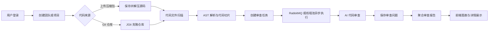
```mermaid
flowchart LR
    A[用户登录] --> B[创建团队或项目]
    B --> C{代码来源}
    C -->|上传压缩包| D[保存并解压源码]
    C -->|Git 仓库| E[JGit 克隆仓库]
    D --> F[代码文件扫描]
    E --> F
    F --> G[AST 解析与代码切片]
    G --> H[创建审查任务]
    H --> I[RabbitMQ 或线程池异步执行]
    I --> J[AI 代码审查]
    J --> K[保存审查问题]
    K --> L[聚合审查报告]
    L --> M[前端图表与详情展示]
```

## 2. 总体架构设计

### 2.1 技术选型

| 层级 | 技术 | 用途 |
| --- | --- | --- |
| 前端框架 | Vue 3、Vite | 构建单页应用与开发构建环境 |
| 前端状态管理 | Pinia | 管理登录态、用户信息等前端共享状态 |
| 前端路由 | Vue Router | 管理登录、项目、团队、统计、审查详情等页面 |
| UI 与图表 | Element Plus、ECharts、Monaco Editor | 表单、布局、统计图表、代码展示与问题标注 |
| 后端框架 | Spring Boot 3.2、Java 17 | 提供 RESTful API 与业务服务 |
| 安全框架 | Spring Security、JWT | 无状态认证、鉴权过滤与角色声明 |
| ORM | MyBatis-Plus | 实体映射、CRUD、逻辑删除、分页插件 |
| 数据库 | MySQL 8.0 | 持久化用户、团队、项目、代码、任务、问题、报告 |
| 缓存 | Redis 7 | 用户信息缓存、Token 黑名单、审查锁、报告生成锁 |
| 消息队列 | RabbitMQ 3.12 | 代码审查任务异步调度、削峰与超时隔离 |
| Git 操作 | JGit | 克隆和拉取远程 Git 仓库 |
| 代码解析 | JavaParser | Java 代码 AST 提取与结构化切片 |
| AI 调用 | OkHttp、Fastjson2 | 调用通义千问、文心一言、OpenAI 兼容接口和自定义 API |
| 部署 | Docker、Docker Compose、Nginx | 前后端与中间件单机容器化部署 |

### 2.2 分层架构

系统采用前后端分离架构。前端通过 Axios 调用后端 REST API，后端内部采用 Controller-Service-Mapper-Entity 分层，并通过 Redis 与 RabbitMQ 支撑异步处理和状态控制。

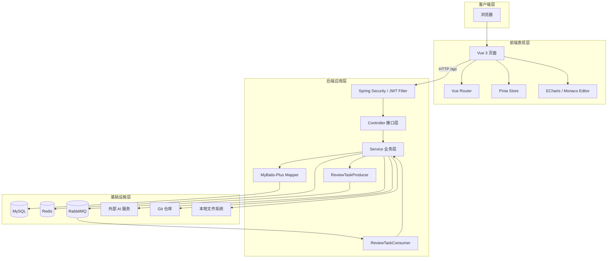
```mermaid
flowchart TB
    subgraph Client[客户端层]
        Browser[浏览器]
    end

    subgraph Frontend[前端表现层]
        Vue[Vue 3 页面]
        Router[Vue Router]
        Pinia[Pinia Store]
        Charts[ECharts / Monaco Editor]
    end

    subgraph Backend[后端应用层]
        Controller[Controller 接口层]
        Security[Spring Security / JWT Filter]
        Service[Service 业务层]
        MQProducer[ReviewTaskProducer]
        MQConsumer[ReviewTaskConsumer]
        Mapper[MyBatis-Plus Mapper]
    end

    subgraph Infra[基础设施层]
        MySQL[(MySQL)]
        Redis[(Redis)]
        RabbitMQ[(RabbitMQ)]
        AI[外部 AI 服务]
        GitRepo[Git 仓库]
        FS[本地文件系统]
    end

    Browser --> Vue
    Vue --> Router
    Vue --> Pinia
    Vue --> Charts
    Vue -->|HTTP /api| Security
    Security --> Controller
    Controller --> Service
    Service --> Mapper
    Mapper --> MySQL
    Service --> Redis
    Service --> MQProducer
    MQProducer --> RabbitMQ
    RabbitMQ --> MQConsumer
    MQConsumer --> Service
    Service --> AI
    Service --> GitRepo
    Service --> FS
```

各层职责如下：

| 层级 | 主要职责 | 代表文件或模块 |
| --- | --- | --- |
| 前端页面层 | 项目管理、团队管理、审查详情、统计分析、个人信息展示 | `frontend/src/views` |
| 前端 API 层 | 封装 Axios 请求、统一 Token 注入和错误处理 | `frontend/src/api/index.js` |
| Controller 层 | 暴露 RESTful API，接收参数并返回统一 `Result` | `AuthController`、`ProjectController`、`ReviewController` |
| Security 层 | JWT 解析、认证上下文设置、接口访问控制 | `SecurityConfig`、`JwtAuthFilter`、`JwtTokenProvider` |
| Service 层 | 用户、团队、项目、代码分析、审查任务、AI 调用等业务逻辑 | `AuthService`、`ProjectService`、`ReviewService`、`AIService` |
| MQ 层 | 审查任务投递、消费和死信队列处理 | `ReviewTaskProducer`、`ReviewTaskConsumer`、`RabbitMQConfig` |
| Mapper 层 | 数据库访问与统计查询 | `mapper` 包 |
| Entity 层 | 与数据库表对应的数据模型 | `model/entity` 包 |

### 2.3 系统功能模块划分

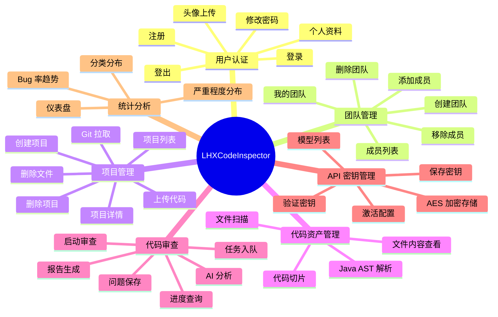
```mermaid
mindmap
  root((LHXCodeInspector))
    用户认证
      注册
      登录
      登出
      个人资料
      修改密码
      头像上传
    团队管理
      创建团队
      我的团队
      成员列表
      添加成员
      移除成员
      删除团队
    项目管理
      创建项目
      项目列表
      项目详情
      上传代码
      Git 拉取
      删除项目
      删除文件
    代码资产管理
      文件扫描
      文件内容查看
      Java AST 解析
      代码切片
    代码审查
      启动审查
      任务入队
      AI 分析
      问题保存
      进度查询
      报告生成
    API 密钥管理
      保存密钥
      AES 加密存储
      激活配置
      验证密钥
      模型列表
    统计分析
      仪表盘
      严重程度分布
      分类分布
      Bug 率趋势
```

### 2.4 关键设计原则

1. 前后端解耦：前端只依赖 REST API，不直接访问数据库和中间件。
2. 审查异步化：AI 审查可能耗时较长，任务通过 RabbitMQ 或线程池异步执行，避免 HTTP 请求长时间阻塞。
3. 代码切片化：系统先将源码拆分为 CodeChunk，再按切片调用 AI，降低模型上下文限制带来的失败率。
4. 数据聚合化：审查问题以 ReviewIssue 明细存储，ReviewReport 保存聚合统计，便于列表和图表快速读取。
5. 无状态认证：后端使用 JWT 承载用户身份和角色，服务端通过 Redis 支持 Token 黑名单和审查锁。

## 3. 数据库设计

### 3.1 实体关系说明

系统核心实体包括用户（User）、团队（Team）、团队成员（TeamMember）、项目（Project）、用户 API 密钥（UserApiKey）、代码文件（CodeFile）、代码切片（CodeChunk）、审查任务（ReviewTask）、审查问题（ReviewIssue）和审查报告（ReviewReport）。

用户（User）与团队（Team）通过团队成员（TeamMember）关联：一个用户可加入多个团队，一个团队可包含多个用户。用户（User）与项目（Project）存在创建关系：一个用户可创建多个项目，一个项目只对应一个创建者。团队（Team）与项目（Project）存在归属关系：一个团队可包含多个项目，一个项目归属于一个团队。项目（Project）与代码文件（CodeFile）关联：一个项目可包含多个代码文件。代码文件（CodeFile）与代码切片（CodeChunk）关联：一个代码文件可被拆分为多个代码切片。代码切片（CodeChunk）与审查任务（ReviewTask）关联：一个切片在一次审查过程中对应一个审查任务。审查任务（ReviewTask）与审查问题（ReviewIssue）关联：一个审查任务可产生多条审查问题。项目（Project）与审查报告（ReviewReport）关联：一个项目最终聚合生成一份审查报告。用户（User）与用户 API 密钥（UserApiKey）关联：一个用户可配置多个 AI API 密钥。

#### 3.1.1 用户实体属性图

用户实体属性图围绕在线代码审查与检测系统中的用户信息管理需求进行设计，主要用于存储和管理系统用户的基本资料、登录凭证及账户权限数据。该实体包含用户ID、用户名、密码、邮箱、头像、角色、状态、创建时间、更新时间以及删除标记等核心属性。其中，用户ID作为主键用于唯一标识用户，用户名用于登录识别，密码用于保存 BCrypt 加密后的登录凭证，角色和状态用于支撑系统认证与权限控制。用户实体属性如下图所示。

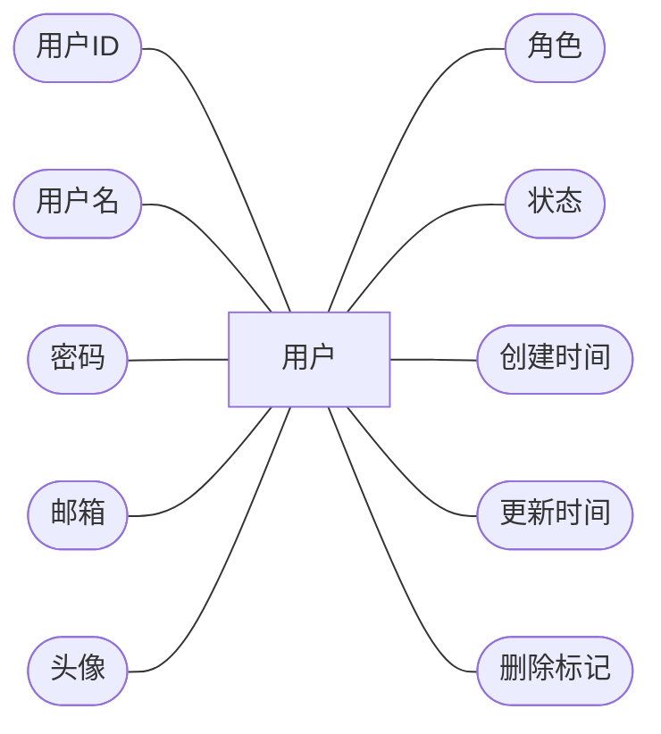
```mermaid
flowchart LR
    User[用户]
    id([用户ID])
    username([用户名])
    password([密码])
    email([邮箱])
    avatar([头像])
    role([角色])
    status([状态])
    createTime([创建时间])
    updateTime([更新时间])
    deleted([删除标记])

    id --- User
    username --- User
    password --- User
    email --- User
    avatar --- User
    User --- role
    User --- status
    User --- createTime
    User --- updateTime
    User --- deleted
```

#### 3.1.2 团队实体属性图

团队实体属性图围绕在线代码审查与检测系统中的团队协作管理需求进行设计，主要用于存储团队的基本信息及团队所有者数据。该实体包含团队ID、团队名称、团队描述、创建者ID、创建时间、更新时间以及删除标记等属性。其中，团队ID作为主键用于唯一标识团队，创建者ID用于关联团队负责人，团队名称和团队描述用于展示和区分不同研发团队。团队实体属性如下图所示。

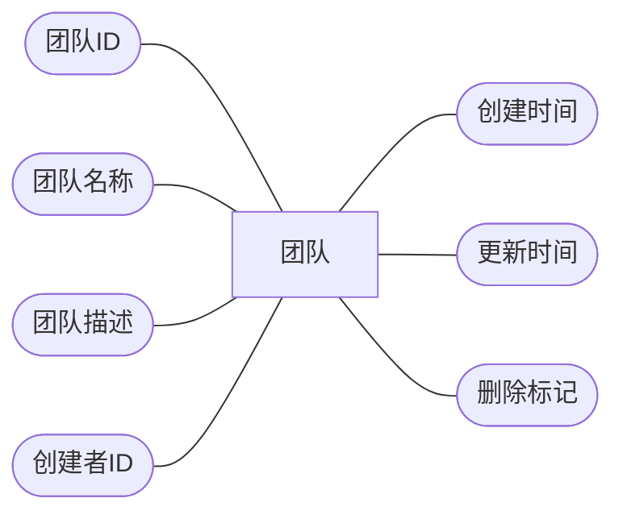
```mermaid
flowchart LR
    Team[团队]
    id([团队ID])
    name([团队名称])
    description([团队描述])
    ownerId([创建者ID])
    createTime([创建时间])
    updateTime([更新时间])
    deleted([删除标记])

    id --- Team
    name --- Team
    description --- Team
    ownerId --- Team
    Team --- createTime
    Team --- updateTime
    Team --- deleted
```

#### 3.1.3 团队成员实体属性图

团队成员实体属性图围绕团队与用户之间的成员关系进行设计，主要用于描述用户加入团队后的身份信息和团队内权限。该实体包含成员关系ID、团队ID、用户ID、团队角色、加入时间以及创建时间等属性。其中，成员关系ID作为主键用于唯一标识一条团队成员记录，团队ID和用户ID共同描述用户与团队之间的关联关系，团队角色用于区分 `LEADER`、`ADMIN` 和 `MEMBER` 等不同权限级别。团队成员实体属性如下图所示。

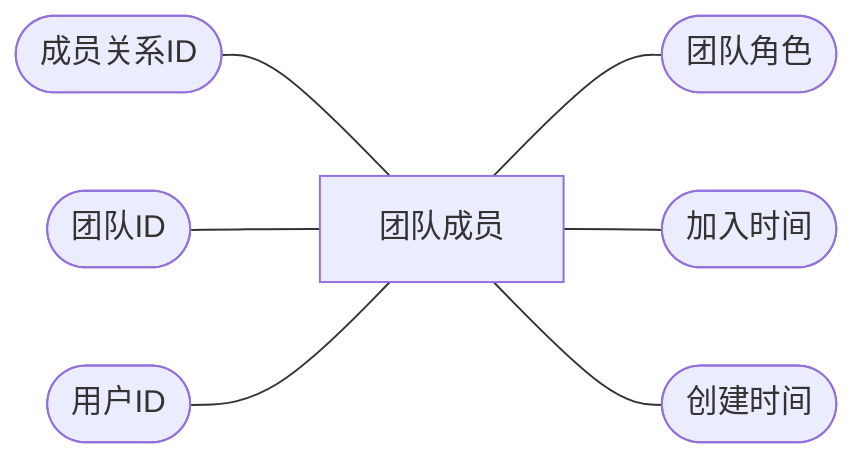
```mermaid
flowchart LR
    TeamMember[团队成员]
    id([成员关系ID])
    teamId([团队ID])
    userId([用户ID])
    role([团队角色])
    joinTime([加入时间])
    createTime([创建时间])

    id --- TeamMember
    teamId --- TeamMember
    userId --- TeamMember
    TeamMember --- role
    TeamMember --- joinTime
    TeamMember --- createTime
```

#### 3.1.4 项目实体属性图

项目实体属性图围绕在线代码审查与检测系统中的项目管理需求进行设计，主要用于存储被审查项目的基础信息、代码来源信息、统计信息及审查状态。该实体包含项目ID、团队ID、项目名称、项目描述、源码类型、Git地址、Git分支、本地仓库路径、主要语言、文件总数、代码总行数、审查状态、创建者ID、创建时间、更新时间以及删除标记等属性。其中，项目ID作为主键用于唯一标识项目，源码类型用于区分上传代码和 Git 仓库拉取，审查状态用于表示项目当前处于待审查、审查中、已完成或失败状态。项目实体属性如下图所示。

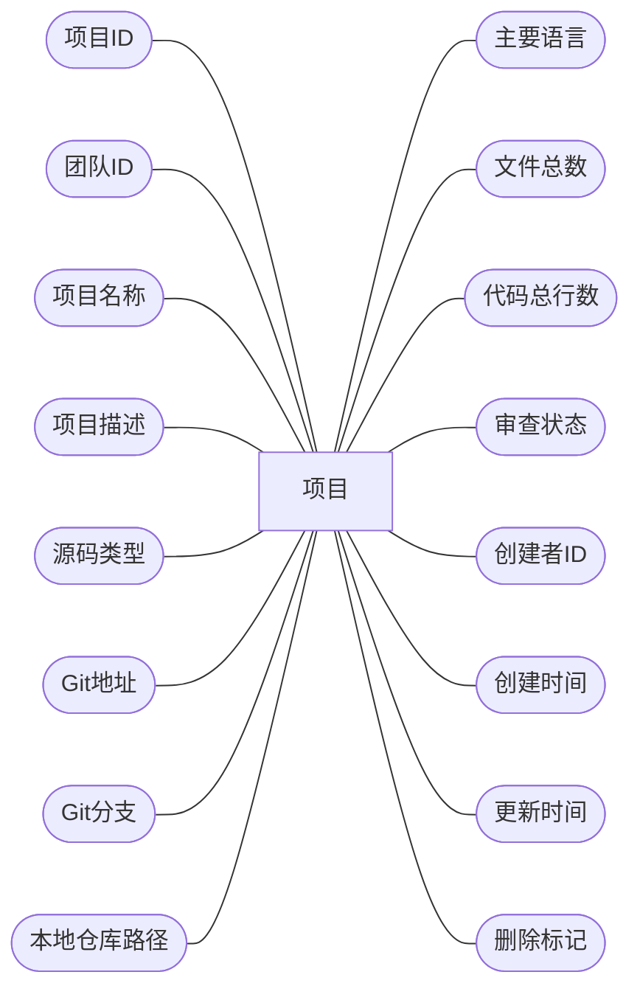
```mermaid
flowchart LR
    Project[项目]
    id([项目ID])
    teamId([团队ID])
    name([项目名称])
    description([项目描述])
    sourceType([源码类型])
    gitUrl([Git地址])
    gitBranch([Git分支])
    repoPath([本地仓库路径])
    language([主要语言])
    totalFiles([文件总数])
    totalLines([代码总行数])
    reviewStatus([审查状态])
    creatorId([创建者ID])
    createTime([创建时间])
    updateTime([更新时间])
    deleted([删除标记])

    id --- Project
    teamId --- Project
    name --- Project
    description --- Project
    sourceType --- Project
    gitUrl --- Project
    gitBranch --- Project
    repoPath --- Project
    Project --- language
    Project --- totalFiles
    Project --- totalLines
    Project --- reviewStatus
    Project --- creatorId
    Project --- createTime
    Project --- updateTime
    Project --- deleted
```

#### 3.1.5 用户 API 密钥实体属性图

用户 API 密钥实体属性图围绕 AI 服务调用配置管理需求进行设计，主要用于存储用户自定义大模型服务的访问凭证和模型配置。该实体包含密钥配置ID、用户ID、AI提供商、加密API Key、加密Secret Key、接口地址、模型名称、是否激活、是否有效、最后验证时间、创建时间以及更新时间等属性。其中，密钥配置ID作为主键用于唯一标识一条密钥配置，用户ID用于关联密钥所属用户，加密API Key和加密Secret Key用于保存经过 AES 加密后的敏感凭证，是否激活用于确定审查任务优先使用的模型配置。用户 API 密钥实体属性如下图所示。

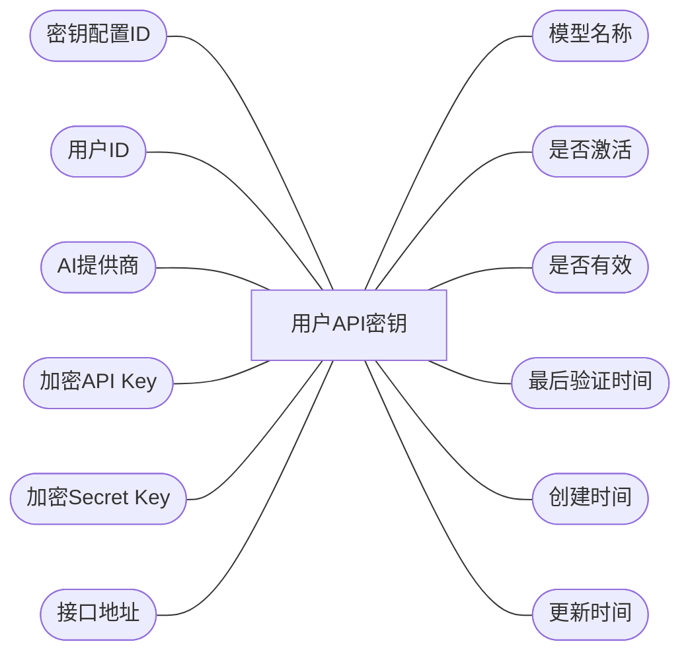
```mermaid
flowchart LR
    UserApiKey[用户API密钥]
    id([密钥配置ID])
    userId([用户ID])
    provider([AI提供商])
    apiKeyEncrypted([加密API Key])
    secretKeyEncrypted([加密Secret Key])
    baseUrl([接口地址])
    modelName([模型名称])
    isActive([是否激活])
    isValid([是否有效])
    lastValidatedAt([最后验证时间])
    createTime([创建时间])
    updateTime([更新时间])

    id --- UserApiKey
    userId --- UserApiKey
    provider --- UserApiKey
    apiKeyEncrypted --- UserApiKey
    secretKeyEncrypted --- UserApiKey
    baseUrl --- UserApiKey
    UserApiKey --- modelName
    UserApiKey --- isActive
    UserApiKey --- isValid
    UserApiKey --- lastValidatedAt
    UserApiKey --- createTime
    UserApiKey --- updateTime
```

#### 3.1.6 代码文件实体属性图

代码文件实体属性图围绕项目源码文件管理需求进行设计，主要用于存储系统扫描并解析后的源代码文件信息。该实体包含文件ID、项目ID、文件路径、文件名、文件内容、AST数据、代码行数、切片数量以及创建时间等属性。其中，文件ID作为主键用于唯一标识代码文件，项目ID用于关联所属项目，文件内容用于支撑在线代码查看与审查上下文构造，AST数据用于保存 JavaParser 解析后的结构化信息。代码文件实体属性如下图所示。

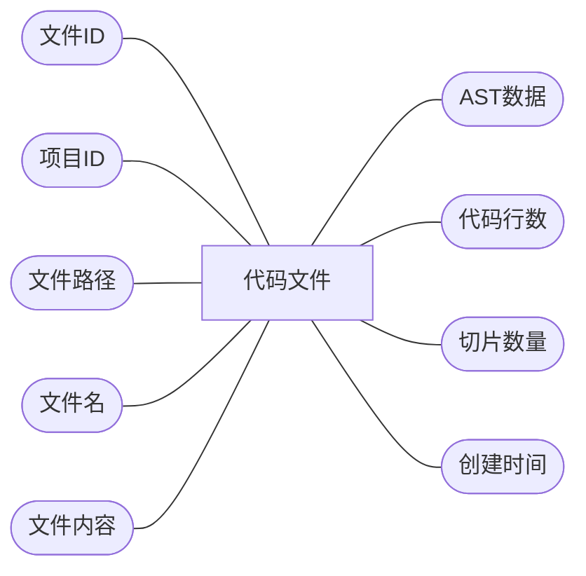
```mermaid
flowchart LR
    CodeFile[代码文件]
    id([文件ID])
    projectId([项目ID])
    filePath([文件路径])
    fileName([文件名])
    fileContent([文件内容])
    astData([AST数据])
    lineCount([代码行数])
    chunkCount([切片数量])
    createTime([创建时间])

    id --- CodeFile
    projectId --- CodeFile
    filePath --- CodeFile
    fileName --- CodeFile
    fileContent --- CodeFile
    CodeFile --- astData
    CodeFile --- lineCount
    CodeFile --- chunkCount
    CodeFile --- createTime
```

#### 3.1.7 代码切片实体属性图

代码切片实体属性图围绕大文件拆分与 AI Token 限制控制需求进行设计，主要用于存储代码文件被拆分后的审查单元。该实体包含切片ID、文件ID、项目ID、切片序号、切片类型、元素名称、切片内容、起始行、结束行以及创建时间等属性。其中，切片ID作为主键用于唯一标识代码切片，文件ID和项目ID用于定位切片所属代码范围，切片类型用于区分类级、方法级、方法分段和普通代码块等不同切片来源。代码切片实体属性如下图所示。

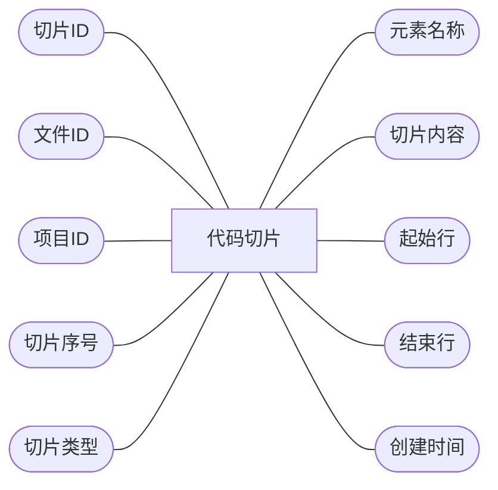
```mermaid
flowchart LR
    CodeChunk[代码切片]
    id([切片ID])
    fileId([文件ID])
    projectId([项目ID])
    chunkIndex([切片序号])
    chunkType([切片类型])
    elementName([元素名称])
    chunkContent([切片内容])
    startLine([起始行])
    endLine([结束行])
    createTime([创建时间])

    id --- CodeChunk
    fileId --- CodeChunk
    projectId --- CodeChunk
    chunkIndex --- CodeChunk
    chunkType --- CodeChunk
    CodeChunk --- elementName
    CodeChunk --- chunkContent
    CodeChunk --- startLine
    CodeChunk --- endLine
    CodeChunk --- createTime
```

#### 3.1.8 审查任务实体属性图

审查任务实体属性图围绕代码审查异步任务调度需求进行设计，主要用于记录每个代码切片的审查执行状态、AI 模型信息及任务执行时间。该实体包含任务ID、项目ID、切片ID、用户ID、任务状态、错误信息、AI提供商、AI模型、Prompt Token数、Completion Token数、开始时间、完成时间以及创建时间等属性。其中，任务ID作为主键用于唯一标识审查任务，项目ID和切片ID用于定位被审查代码范围，任务状态用于描述任务处于待处理、处理中、已完成或失败等阶段。审查任务实体属性如下图所示。

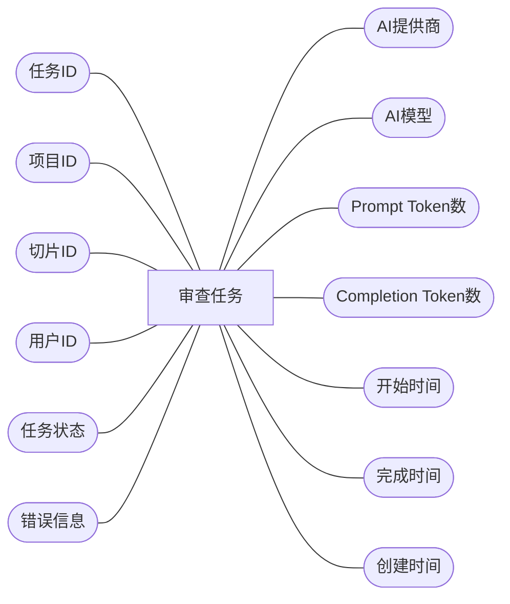
```mermaid
flowchart LR
    ReviewTask[审查任务]
    id([任务ID])
    projectId([项目ID])
    chunkId([切片ID])
    userId([用户ID])
    status([任务状态])
    errorMsg([错误信息])
    aiProvider([AI提供商])
    aiModel([AI模型])
    promptTokens([Prompt Token数])
    completionTokens([Completion Token数])
    startTime([开始时间])
    finishTime([完成时间])
    createTime([创建时间])

    id --- ReviewTask
    projectId --- ReviewTask
    chunkId --- ReviewTask
    userId --- ReviewTask
    status --- ReviewTask
    errorMsg --- ReviewTask
    ReviewTask --- aiProvider
    ReviewTask --- aiModel
    ReviewTask --- promptTokens
    ReviewTask --- completionTokens
    ReviewTask --- startTime
    ReviewTask --- finishTime
    ReviewTask --- createTime
```

#### 3.1.9 审查问题实体属性图

审查问题实体属性图围绕 AI 代码审查结果管理需求进行设计，主要用于存储系统在代码切片审查过程中发现的具体问题及修复建议。该实体包含问题ID、任务ID、项目ID、文件路径、起始行、结束行、严重程度、问题分类、问题标题、问题描述、修复建议、问题代码片段、修复后代码、处理状态、处理人、处理时间以及创建时间等属性。其中，问题ID作为主键用于唯一标识审查问题，严重程度和问题分类用于支撑统计分析，处理状态用于跟踪问题是否已解决或忽略。审查问题实体属性如下图所示。

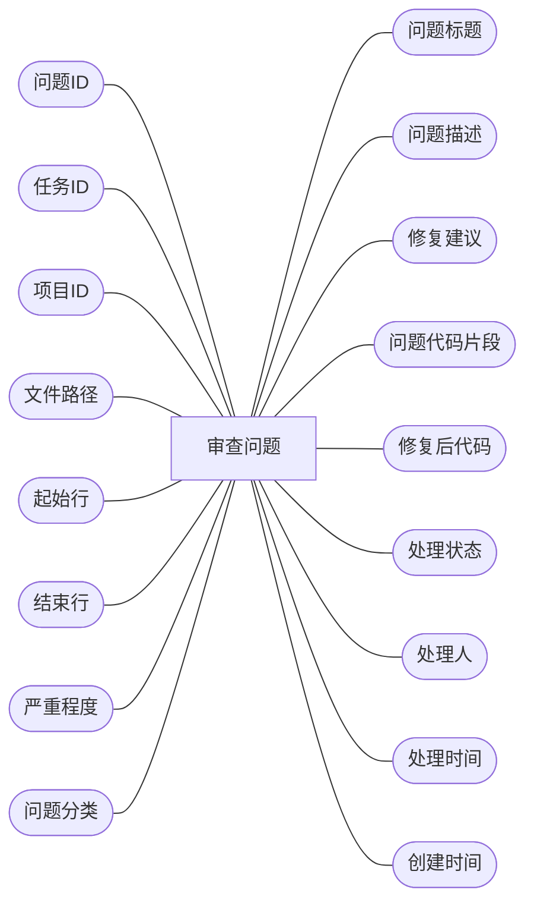
```mermaid
flowchart LR
    ReviewIssue[审查问题]
    id([问题ID])
    taskId([任务ID])
    projectId([项目ID])
    filePath([文件路径])
    lineStart([起始行])
    lineEnd([结束行])
    severity([严重程度])
    category([问题分类])
    title([问题标题])
    description([问题描述])
    suggestion([修复建议])
    codeSnippet([问题代码片段])
    fixedCode([修复后代码])
    status([处理状态])
    resolvedBy([处理人])
    resolvedTime([处理时间])
    createTime([创建时间])

    id --- ReviewIssue
    taskId --- ReviewIssue
    projectId --- ReviewIssue
    filePath --- ReviewIssue
    lineStart --- ReviewIssue
    lineEnd --- ReviewIssue
    severity --- ReviewIssue
    category --- ReviewIssue
    ReviewIssue --- title
    ReviewIssue --- description
    ReviewIssue --- suggestion
    ReviewIssue --- codeSnippet
    ReviewIssue --- fixedCode
    ReviewIssue --- status
    ReviewIssue --- resolvedBy
    ReviewIssue --- resolvedTime
    ReviewIssue --- createTime
```

#### 3.1.10 审查报告实体属性图

审查报告实体属性图围绕项目级审查结果汇总与统计展示需求进行设计，主要用于保存一个项目审查完成后的聚合统计数据。该实体包含报告ID、项目ID、问题总数、严重问题数、重要问题数、次要问题数、提示问题数、安全问题数、Bug数、代码风格问题数、性能问题数、最佳实践问题数、Bug率、已审查文件数、已审查行数、审查总结、创建时间以及更新时间等属性。其中，报告ID作为主键用于唯一标识审查报告，项目ID用于保证报告与项目的一一对应关系，统计类字段用于支撑仪表盘、饼图、柱状图和趋势图展示。审查报告实体属性如下图所示。

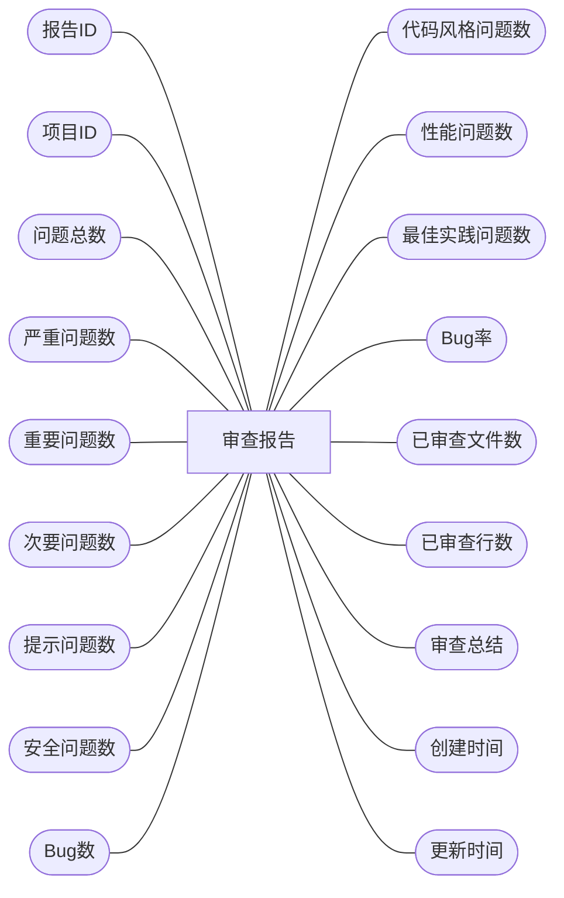
```mermaid
flowchart LR
    ReviewReport[审查报告]
    id([报告ID])
    projectId([项目ID])
    totalIssues([问题总数])
    criticalCount([严重问题数])
    majorCount([重要问题数])
    minorCount([次要问题数])
    infoCount([提示问题数])
    securityCount([安全问题数])
    bugCount([Bug数])
    styleCount([代码风格问题数])
    performanceCount([性能问题数])
    bestPracticeCount([最佳实践问题数])
    bugRate([Bug率])
    reviewedFiles([已审查文件数])
    reviewedLines([已审查行数])
    summary([审查总结])
    createTime([创建时间])
    updateTime([更新时间])

    id --- ReviewReport
    projectId --- ReviewReport
    totalIssues --- ReviewReport
    criticalCount --- ReviewReport
    majorCount --- ReviewReport
    minorCount --- ReviewReport
    infoCount --- ReviewReport
    securityCount --- ReviewReport
    bugCount --- ReviewReport
    ReviewReport --- styleCount
    ReviewReport --- performanceCount
    ReviewReport --- bestPracticeCount
    ReviewReport --- bugRate
    ReviewReport --- reviewedFiles
    ReviewReport --- reviewedLines
    ReviewReport --- summary
    ReviewReport --- createTime
    ReviewReport --- updateTime
```

### 3.2 核心数据表结构

#### 3.2.1 用户表 user

| 字段 | 类型 | 约束 | 说明 |
| --- | --- | --- | --- |
| id | BIGINT | PK, AUTO_INCREMENT | 用户 ID |
| username | VARCHAR(64) | NOT NULL, UNIQUE | 用户名 |
| password | VARCHAR(256) | NOT NULL | BCrypt 加密后的密码 |
| email | VARCHAR(128) | NULL | 邮箱 |
| avatar | VARCHAR(512) | NULL | 头像 URL |
| role | VARCHAR(32) | NOT NULL, DEFAULT `DEVELOPER` | 系统角色：`ADMIN`、`TEAM_LEADER`、`DEVELOPER`、`VIEWER` |
| status | TINYINT | NOT NULL, DEFAULT 1 | 状态：1 启用，0 禁用 |
| create_time | DATETIME | NOT NULL | 创建时间 |
| update_time | DATETIME | NOT NULL | 更新时间 |
| deleted | TINYINT | NOT NULL, DEFAULT 0 | 逻辑删除标记 |

#### 3.2.2 团队表 team

| 字段 | 类型 | 约束 | 说明 |
| --- | --- | --- | --- |
| id | BIGINT | PK, AUTO_INCREMENT | 团队 ID |
| name | VARCHAR(128) | NOT NULL | 团队名称 |
| description | VARCHAR(512) | NULL | 团队描述 |
| owner_id | BIGINT | NOT NULL | 团队创建者用户 ID |
| create_time | DATETIME | NOT NULL | 创建时间 |
| update_time | DATETIME | NOT NULL | 更新时间 |
| deleted | TINYINT | NOT NULL, DEFAULT 0 | 逻辑删除标记 |

#### 3.2.3 团队成员表 team_member

| 字段 | 类型 | 约束 | 说明 |
| --- | --- | --- | --- |
| id | BIGINT | PK, AUTO_INCREMENT | 成员关系 ID |
| team_id | BIGINT | NOT NULL | 团队 ID |
| user_id | BIGINT | NOT NULL | 用户 ID |
| role | VARCHAR(32) | NOT NULL, DEFAULT `MEMBER` | 团队角色：`LEADER`、`ADMIN`、`MEMBER` |
| join_time | DATETIME | NOT NULL | 加入时间 |
| create_time | DATETIME | NOT NULL | 创建时间 |

#### 3.2.4 项目表 project

| 字段 | 类型 | 约束 | 说明 |
| --- | --- | --- | --- |
| id | BIGINT | PK, AUTO_INCREMENT | 项目 ID |
| team_id | BIGINT | NOT NULL | 所属团队 ID |
| name | VARCHAR(256) | NOT NULL | 项目名称 |
| description | VARCHAR(1024) | NULL | 项目描述 |
| source_type | VARCHAR(32) | NOT NULL | 来源：`UPLOAD`、`GIT` |
| git_url | VARCHAR(1024) | NULL | Git 仓库地址 |
| git_branch | VARCHAR(128) | DEFAULT `main` | Git 分支 |
| repo_path | VARCHAR(512) | NULL | 本地源码目录 |
| language | VARCHAR(64) | DEFAULT `java` | 主要语言 |
| total_files | INT | DEFAULT 0 | 已解析文件总数 |
| total_lines | BIGINT | DEFAULT 0 | 代码总行数 |
| review_status | VARCHAR(32) | DEFAULT `PENDING` | 审查状态：`PENDING`、`IN_PROGRESS`、`COMPLETED`、`FAILED` |
| creator_id | BIGINT | NOT NULL | 创建者用户 ID |
| create_time | DATETIME | NOT NULL | 创建时间 |
| update_time | DATETIME | NOT NULL | 更新时间 |
| deleted | TINYINT | NOT NULL, DEFAULT 0 | 逻辑删除标记 |

#### 3.2.5 代码文件表 code_file

| 字段 | 类型 | 约束 | 说明 |
| --- | --- | --- | --- |
| id | BIGINT | PK, AUTO_INCREMENT | 文件 ID |
| project_id | BIGINT | NOT NULL | 所属项目 ID |
| file_path | VARCHAR(1024) | NOT NULL | 文件相对路径 |
| file_name | VARCHAR(256) | NOT NULL | 文件名 |
| file_content | LONGTEXT | NULL | 文件内容 |
| ast_data | LONGTEXT | NULL | AST 解析结果 JSON |
| line_count | INT | DEFAULT 0 | 文件行数 |
| chunk_count | INT | DEFAULT 0 | 切片数量 |
| create_time | DATETIME | NOT NULL | 创建时间 |

#### 3.2.6 代码切片表 code_chunk

| 字段 | 类型 | 约束 | 说明 |
| --- | --- | --- | --- |
| id | BIGINT | PK, AUTO_INCREMENT | 切片 ID |
| file_id | BIGINT | NOT NULL | 所属文件 ID |
| project_id | BIGINT | NOT NULL | 所属项目 ID |
| chunk_index | INT | NOT NULL | 文件内切片序号 |
| chunk_type | VARCHAR(32) | NULL | 切片类型：`CLASS`、`METHOD`、`METHOD_PART`、`BLOCK` |
| element_name | VARCHAR(256) | NULL | 类名、方法名或代码块名称 |
| chunk_content | LONGTEXT | NOT NULL | 切片代码内容 |
| start_line | INT | NULL | 文件内起始行 |
| end_line | INT | NULL | 文件内结束行 |
| create_time | DATETIME | NOT NULL | 创建时间 |

#### 3.2.7 审查任务表 review_task

| 字段 | 类型 | 约束 | 说明 |
| --- | --- | --- | --- |
| id | BIGINT | PK, AUTO_INCREMENT | 审查任务 ID |
| project_id | BIGINT | NOT NULL | 项目 ID |
| chunk_id | BIGINT | NULL | 代码切片 ID |
| user_id | BIGINT | NOT NULL | 提交审查的用户 ID |
| status | VARCHAR(32) | NOT NULL, DEFAULT `PENDING` | 任务状态：`PENDING`、`QUEUED`、`PROCESSING`、`COMPLETED`、`FAILED` |
| error_msg | VARCHAR(1024) | NULL | 失败原因 |
| ai_provider | VARCHAR(32) | NULL | AI 提供商 |
| ai_model | VARCHAR(64) | NULL | AI 模型 |
| prompt_tokens | INT | DEFAULT 0 | Prompt Token 数 |
| completion_tokens | INT | DEFAULT 0 | Completion Token 数 |
| start_time | DATETIME | NULL | 开始处理时间 |
| finish_time | DATETIME | NULL | 完成时间 |
| create_time | DATETIME | NOT NULL | 创建时间 |

#### 3.2.8 审查问题表 review_issue

| 字段 | 类型 | 约束 | 说明 |
| --- | --- | --- | --- |
| id | BIGINT | PK, AUTO_INCREMENT | 问题 ID |
| task_id | BIGINT | NOT NULL | 来源审查任务 ID |
| project_id | BIGINT | NOT NULL | 所属项目 ID |
| file_path | VARCHAR(1024) | NOT NULL | 文件路径 |
| line_start | INT | NOT NULL | 起始行号 |
| line_end | INT | NULL | 结束行号 |
| severity | VARCHAR(32) | NOT NULL | 严重程度：`CRITICAL`、`MAJOR`、`MINOR`、`INFO` |
| category | VARCHAR(64) | NOT NULL | 分类：`SECURITY`、`BUG`、`CODE_STYLE`、`PERFORMANCE`、`BEST_PRACTICE` |
| title | VARCHAR(512) | NOT NULL | 问题标题 |
| description | TEXT | NULL | 问题描述 |
| suggestion | TEXT | NULL | 修复建议 |
| code_snippet | TEXT | NULL | 问题代码片段 |
| fixed_code | TEXT | NULL | AI 建议修复代码 |
| status | VARCHAR(32) | DEFAULT `OPEN` | 处理状态：`OPEN`、`RESOLVED`、`IGNORED` |
| resolved_by | BIGINT | NULL | 处理人用户 ID |
| resolved_time | DATETIME | NULL | 处理时间 |
| create_time | DATETIME | NOT NULL | 创建时间 |

#### 3.2.9 审查报告表 review_report

| 字段 | 类型 | 约束 | 说明 |
| --- | --- | --- | --- |
| id | BIGINT | PK, AUTO_INCREMENT | 报告 ID |
| project_id | BIGINT | NOT NULL, UNIQUE | 项目 ID |
| total_issues | INT | DEFAULT 0 | 问题总数 |
| critical_count | INT | DEFAULT 0 | 严重问题数 |
| major_count | INT | DEFAULT 0 | 重要问题数 |
| minor_count | INT | DEFAULT 0 | 次要问题数 |
| info_count | INT | DEFAULT 0 | 提示问题数 |
| security_count | INT | DEFAULT 0 | 安全问题数 |
| bug_count | INT | DEFAULT 0 | Bug 问题数 |
| style_count | INT | DEFAULT 0 | 代码风格问题数 |
| performance_count | INT | DEFAULT 0 | 性能问题数 |
| best_practice_count | INT | DEFAULT 0 | 最佳实践问题数 |
| bug_rate | DECIMAL(10,4) | NULL | Bug 率，当前按严重和重要问题数每千行折算 |
| reviewed_files | INT | DEFAULT 0 | 已审查文件数 |
| reviewed_lines | BIGINT | DEFAULT 0 | 已审查行数 |
| summary | TEXT | NULL | 审查总结 |
| create_time | DATETIME | NOT NULL | 创建时间 |
| update_time | DATETIME | NOT NULL | 更新时间 |

#### 3.2.10 用户 API 密钥表 user_api_key

| 字段 | 类型 | 约束 | 说明 |
| --- | --- | --- | --- |
| id | BIGINT | PK, AUTO_INCREMENT | API 密钥配置 ID |
| user_id | BIGINT | NOT NULL | 用户 ID |
| provider | VARCHAR(32) | NOT NULL | AI 提供商：`tongyi`、`wenxin`、`openai`、`custom` |
| api_key_encrypted | TEXT | NULL | AES 加密后的 API Key |
| secret_key_encrypted | TEXT | NULL | AES 加密后的 Secret Key |
| base_url | VARCHAR(512) | NULL | API 端点 |
| model_name | VARCHAR(128) | NOT NULL | 模型名称 |
| is_active | TINYINT | NOT NULL, DEFAULT 0 | 是否激活 |
| is_valid | TINYINT | NOT NULL, DEFAULT 1 | 是否验证通过 |
| last_validated_at | DATETIME | NULL | 最近验证时间 |
| create_time | DATETIME | NOT NULL | 创建时间 |
| update_time | DATETIME | NOT NULL | 更新时间 |

### 3.3 索引设计

| 表 | 索引 | 字段 | 设计目的 |
| --- | --- | --- | --- |
| user | uk username | username | 保证用户名唯一，支持登录查询 |
| user | idx_username | username | 加速用户名检索 |
| user | idx_role | role | 支持按角色筛选 |
| team | idx_owner | owner_id | 查询用户创建的团队 |
| team_member | uk_team_user | team_id, user_id | 防止重复加入同一团队 |
| team_member | idx_user_id | user_id | 查询用户所在团队 |
| project | idx_team | team_id | 查询团队项目 |
| project | idx_creator | creator_id | 查询用户创建项目 |
| project | idx_status | review_status | 按审查状态筛选 |
| code_file | idx_project | project_id | 查询项目文件 |
| code_chunk | idx_file | file_id | 查询文件切片 |
| code_chunk | idx_project | project_id | 启动项目审查时查询全部切片 |
| review_task | idx_project | project_id | 查询项目审查进度 |
| review_task | idx_status | status | 按任务状态统计 |
| review_task | idx_user | user_id | 查询用户审查任务 |
| review_issue | idx_task | task_id | 查询任务产生的问题 |
| review_issue | idx_project | project_id | 查询项目问题列表 |
| review_issue | idx_severity | severity | 严重程度统计 |
| review_issue | idx_category | category | 问题分类统计 |
| review_report | uk project_id | project_id | 保证每项目一份聚合报告 |
| user_api_key | idx_user | user_id | 查询用户密钥配置 |
| user_api_key | idx_user_active | user_id, is_active | 查询用户当前激活密钥 |

## 4. 类图设计

### 4.1 LHXCodeInspector 类图（SpringBoot 简化版）

系统后端采用 Controller-Service-Mapper-Entity 的典型 SpringBoot 分层结构。表现层（Controller）负责接收前端请求并返回统一响应；业务逻辑层（Service）负责完成认证、团队、项目、代码审查与 API 密钥等核心业务处理；数据访问层（Mapper/DAO）负责数据库读写；实体层（Entity）用于映射数据库表结构。类图按照业务模块自上而下绘制，虚线表示依赖关系，实线表示实体之间的业务关联关系。

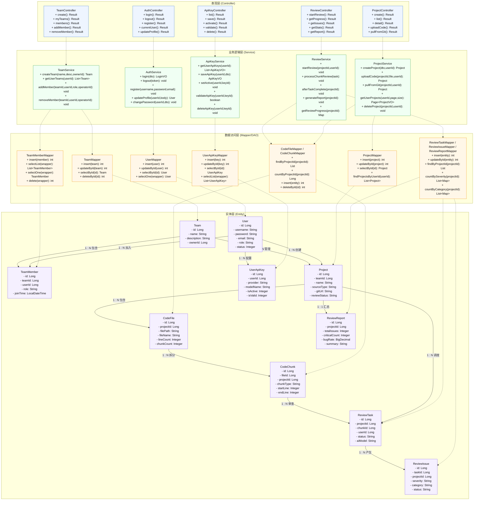
```mermaid
flowchart TB
    subgraph L1["表现层 (Controller)"]
        direction LR
        AuthC["AuthController<br/>+ login(): Result<br/>+ logout(): Result<br/>+ register(): Result<br/>+ currentUser(): Result<br/>+ updateProfile(): Result"]
        TeamC["TeamController<br/>+ create(): Result<br/>+ myTeams(): Result<br/>+ members(): Result<br/>+ addMember(): Result<br/>+ removeMember(): Result"]
        ProjectC["ProjectController<br/>+ create(): Result<br/>+ list(): Result<br/>+ detail(): Result<br/>+ uploadCode(): Result<br/>+ pullFromGit(): Result"]
        ReviewC["ReviewController<br/>+ startReview(): Result<br/>+ getProgress(): Result<br/>+ getIssues(): Result<br/>+ getStats(): Result<br/>+ getReport(): Result"]
        ApiKeyC["ApiKeyController<br/>+ list(): Result<br/>+ save(): Result<br/>+ activate(): Result<br/>+ validate(): Result<br/>+ delete(): Result"]
    end

    subgraph L2["业务逻辑层 (Service)"]
        direction LR
        AuthS["AuthService<br/>+ login(dto): LoginVO<br/>+ logout(token): void<br/>+ register(username,password,email): void<br/>+ updateProfile(userId,body): User<br/>+ changePassword(userId,dto): void"]
        TeamS["TeamService<br/>+ createTeam(name,desc,ownerId): Team<br/>+ getUserTeams(userId): List&lt;Team&gt;<br/>+ addMember(teamId,userId,role,operatorId): void<br/>+ removeMember(teamId,userId,operatorId): void"]
        ProjectS["ProjectService<br/>+ createProject(dto,userId): Project<br/>+ uploadCode(projectId,file,userId): Project<br/>+ pullFromGit(projectId,userId): Project<br/>+ getUserProjects(userId,page,size): Page&lt;ProjectVO&gt;<br/>+ deleteProject(projectId,userId): void"]
        ReviewS["ReviewService<br/>+ startReview(projectId,userId): void<br/>+ processChunkReview(task): void<br/>+ afterTaskComplete(projectId): void<br/>+ generateReport(projectId): void<br/>+ getReviewProgress(projectId): Map"]
        ApiKeyS["ApiKeyService<br/>+ getUserApiKeys(userId): List&lt;ApiKeyVO&gt;<br/>+ saveApiKey(userId,dto): ApiKeyVO<br/>+ setActive(userId,keyId): void<br/>+ validateApiKey(userId,keyId): boolean<br/>+ deleteApiKey(userId,keyId): void"]
    end

    subgraph L3["数据访问层 (Mapper/DAO)"]
        direction LR
        UserM["UserMapper<br/>+ insert(user): int<br/>+ updateById(user): int<br/>+ selectById(id): User<br/>+ selectOne(wrapper): User"]
        TeamM["TeamMapper<br/>+ insert(team): int<br/>+ updateById(team): int<br/>+ selectById(id): Team<br/>+ deleteById(id): int"]
        TeamMemberM["TeamMemberMapper<br/>+ insert(member): int<br/>+ selectList(wrapper): List&lt;TeamMember&gt;<br/>+ selectOne(wrapper): TeamMember<br/>+ delete(wrapper): int"]
        ProjectM["ProjectMapper<br/>+ insert(project): int<br/>+ updateById(project): int<br/>+ selectById(id): Project<br/>+ findProjectsByUserId(userId): List&lt;Project&gt;"]
        CodeM["CodeFileMapper / CodeChunkMapper<br/>+ findByProjectId(projectId): List<br/>+ countByProjectId(projectId): Long<br/>+ insert(entity): int<br/>+ deleteById(id): int"]
        ReviewM["ReviewTaskMapper / ReviewIssueMapper / ReviewReportMapper<br/>+ insert(entity): int<br/>+ updateById(entity): int<br/>+ findByProjectId(projectId): List<br/>+ countBySeverity(projectId): List&lt;Map&gt;<br/>+ countByCategory(projectId): List&lt;Map&gt;"]
        ApiKeyM["UserApiKeyMapper<br/>+ insert(key): int<br/>+ updateById(key): int<br/>+ selectById(id): UserApiKey<br/>+ selectList(wrapper): List&lt;UserApiKey&gt;"]
    end

    subgraph L4["实体层 (Entity)"]
        direction LR
        UserE["User<br/>- id: Long<br/>- username: String<br/>- password: String<br/>- email: String<br/>- role: String<br/>- status: Integer"]
        TeamE["Team<br/>- id: Long<br/>- name: String<br/>- description: String<br/>- ownerId: Long"]
        TeamMemberE["TeamMember<br/>- id: Long<br/>- teamId: Long<br/>- userId: Long<br/>- role: String<br/>- joinTime: LocalDateTime"]
        ProjectE["Project<br/>- id: Long<br/>- teamId: Long<br/>- name: String<br/>- sourceType: String<br/>- gitUrl: String<br/>- reviewStatus: String"]
        UserApiKeyE["UserApiKey<br/>- id: Long<br/>- userId: Long<br/>- provider: String<br/>- modelName: String<br/>- isActive: Integer<br/>- isValid: Integer"]
        CodeFileE["CodeFile<br/>- id: Long<br/>- projectId: Long<br/>- filePath: String<br/>- fileName: String<br/>- lineCount: Integer<br/>- chunkCount: Integer"]
        CodeChunkE["CodeChunk<br/>- id: Long<br/>- fileId: Long<br/>- projectId: Long<br/>- chunkType: String<br/>- startLine: Integer<br/>- endLine: Integer"]
        ReviewTaskE["ReviewTask<br/>- id: Long<br/>- projectId: Long<br/>- chunkId: Long<br/>- userId: Long<br/>- status: String<br/>- aiModel: String"]
        ReviewIssueE["ReviewIssue<br/>- id: Long<br/>- taskId: Long<br/>- projectId: Long<br/>- severity: String<br/>- category: String<br/>- status: String"]
        ReviewReportE["ReviewReport<br/>- id: Long<br/>- projectId: Long<br/>- totalIssues: Integer<br/>- criticalCount: Integer<br/>- bugRate: BigDecimal<br/>- summary: String"]
    end

    AuthC -.-> AuthS
    TeamC -.-> TeamS
    ProjectC -.-> ProjectS
    ReviewC -.-> ReviewS
    ApiKeyC -.-> ApiKeyS

    AuthS -.-> UserM
    TeamS -.-> TeamM
    TeamS -.-> TeamMemberM
    ProjectS -.-> ProjectM
    ProjectS -.-> CodeM
    ReviewS -.-> ReviewM
    ReviewS -.-> CodeM
    ApiKeyS -.-> ApiKeyM

    UserM -.-> UserE
    TeamM -.-> TeamE
    TeamMemberM -.-> TeamMemberE
    ProjectM -.-> ProjectE
    CodeM -.-> CodeFileE
    CodeM -.-> CodeChunkE
    ReviewM -.-> ReviewTaskE
    ReviewM -.-> ReviewIssueE
    ReviewM -.-> ReviewReportE
    ApiKeyM -.-> UserApiKeyE

    UserE -- "1 : N 创建" --> ProjectE
    UserE -- "1 : N 配置" --> UserApiKeyE
    UserE -- "1 : N 加入" --> TeamMemberE
    TeamE -- "1 : N 包含" --> TeamMemberE
    TeamE -- "1 : N 管理" --> ProjectE
    ProjectE -- "1 : N 包含" --> CodeFileE
    CodeFileE -- "1 : N 拆分" --> CodeChunkE
    ProjectE -- "1 : N 调度" --> ReviewTaskE
    CodeChunkE -- "1 : N 审查" --> ReviewTaskE
    ReviewTaskE -- "1 : N 产生" --> ReviewIssueE
    ProjectE -- "1 : 1 汇总" --> ReviewReportE

    classDef controller fill:#eef5ff,stroke:#2f6fd6,stroke-width:1px,color:#111;
    classDef service fill:#f0fff3,stroke:#2f9e44,stroke-width:1px,color:#111;
    classDef mapper fill:#fff7e8,stroke:#f08c00,stroke-width:1px,color:#111;
    classDef entity fill:#f5f0ff,stroke:#7950f2,stroke-width:1px,color:#111;
    class AuthC,TeamC,ProjectC,ReviewC,ApiKeyC controller;
    class AuthS,TeamS,ProjectS,ReviewS,ApiKeyS service;
    class UserM,TeamM,TeamMemberM,ProjectM,CodeM,ReviewM,ApiKeyM mapper;
    class UserE,TeamE,TeamMemberE,ProjectE,UserApiKeyE,CodeFileE,CodeChunkE,ReviewTaskE,ReviewIssueE,ReviewReportE entity;
```

图中表现层、业务逻辑层、数据访问层和实体层之间使用依赖关系连接，表示上层调用下层完成业务处理；实体之间使用关联关系连接，表示数据库实体之间的一对多或一对一业务关系。

### 4.2 类图详细说明

LHXCodeInspector 后端类图以 SpringBoot 常见分层架构为基础进行设计，整体遵循“Controller 接收请求、Service 编排业务、Mapper 访问数据、Entity 承载数据”的调用方向。各层之间职责清晰，避免表现层直接操作数据库，也避免数据访问层承担业务判断，从而提高系统的可维护性和模块扩展能力。

表现层由 `AuthController`、`TeamController`、`ProjectController`、`ReviewController` 和 `ApiKeyController` 等控制器组成，主要负责对外暴露 RESTful API。该层接收前端传入的请求参数、路径变量、请求体或文件对象，并将请求转发给对应 Service 处理。控制器本身不直接实现复杂业务逻辑，而是通过统一的 `Result` 响应结构向前端返回处理结果。例如，`ProjectController` 负责项目创建、源码上传和 Git 拉取接口入口，实际的项目权限校验、文件解析和数据持久化均由 `ProjectService` 完成。

业务逻辑层由 `AuthService`、`TeamService`、`ProjectService`、`ReviewService` 和 `ApiKeyService` 等服务类组成，是系统业务规则最集中的部分。`AuthService` 负责用户登录、注册、登出、密码修改和 JWT 相关登录流程；`TeamService` 负责团队创建、成员维护和团队权限判断；`ProjectService` 负责编排项目创建、上传代码、Git 拉取、文件删除和项目删除等流程；`ReviewService` 是代码审查核心服务，负责创建审查任务、调用 AI 审查、保存审查问题、统计审查结果并生成报告；`ApiKeyService` 负责用户 AI API 密钥的保存、加密、激活和验证。

数据访问层由各类 `Mapper` 组成，基于 MyBatis-Plus 完成数据库增删改查操作。`UserMapper`、`TeamMapper`、`ProjectMapper` 等 Mapper 与对应实体表建立映射关系；`CodeFileMapper` 和 `CodeChunkMapper` 用于管理项目源码文件与代码切片；`ReviewTaskMapper`、`ReviewIssueMapper` 和 `ReviewReportMapper` 用于支撑审查任务、审查问题和报告统计数据的持久化。该层只负责数据访问，不直接处理业务状态流转。

实体层由 `User`、`Team`、`TeamMember`、`Project`、`UserApiKey`、`CodeFile`、`CodeChunk`、`ReviewTask`、`ReviewIssue` 和 `ReviewReport` 等实体类组成，分别对应数据库中的核心业务表。实体类通过 MyBatis-Plus 注解与表结构建立映射关系，用于在 Controller、Service、Mapper 之间传递业务数据。实体之间的关系体现了系统的核心业务模型：用户创建项目并加入团队，团队管理项目，项目包含代码文件，代码文件被拆分为代码切片，代码切片生成审查任务，审查任务产生审查问题，项目最终汇总形成审查报告。

在核心代码审查流程中，`ReviewController` 接收“启动审查”请求后调用 `ReviewService.startReview`。`ReviewService` 根据项目 ID 查询代码切片，批量创建 `ReviewTask`，并通过 RabbitMQ 或异步线程池调度执行。任务执行时，`ReviewService.processChunkReview` 读取 `CodeChunk` 和 `CodeFile`，结合 `ApiKeyService` 获取用户当前激活的 AI 密钥，再调用 `AIService` 完成代码片段审查。AI 返回的问题会被转换为 `ReviewIssue` 并保存，所有任务结束后再聚合生成 `ReviewReport`。该流程体现了类图中审查模块从 Controller 到 Service、Mapper、Entity 的完整依赖关系。

在项目代码管理流程中，`ProjectController` 将创建项目、上传源码或 Git 拉取请求转发给 `ProjectService`。`ProjectService` 根据项目来源选择文件上传处理或 `GitService` 克隆仓库，并调用 `CodeAnalysisService` 扫描源码目录。`CodeAnalysisService` 会将源码保存为 `CodeFile`，并依据 AST 结构或行级策略生成 `CodeChunk`。因此，项目模块不仅依赖项目数据访问类，也依赖代码文件、代码切片及代码分析服务。

在安全与密钥管理流程中，`AuthController` 与 `AuthService` 共同完成用户认证入口，`AuthService` 依赖 `UserMapper` 校验用户信息，并通过 JWT 生成登录凭证。`ApiKeyController` 与 `ApiKeyService` 负责用户 API Key 管理，密钥保存时使用 AES 加密，审查执行时再由服务层解密后传递给 AI 调用逻辑。该设计将认证、密钥存储和 AI 调用解耦，降低敏感信息在系统中的暴露范围。

总体来看，该类图体现了 LHXCodeInspector 的主要设计特点：一是采用标准分层结构降低模块耦合；二是围绕项目、代码切片和审查任务构建核心业务链路；三是通过 Service 层集中处理权限校验、事务控制、异步任务和外部服务调用；四是通过 Entity 和 Mapper 层保持数据模型与数据库结构的一致性。

## 5. 详细模块设计

### 5.1 用户认证模块

#### 5.1.1 模块职责

用户认证模块负责用户注册、登录、登出、当前用户查询、个人资料更新、密码修改和头像上传。后端使用 Spring Security 建立统一过滤链，通过 JWT 实现无状态认证。

#### 5.1.2 登录流程

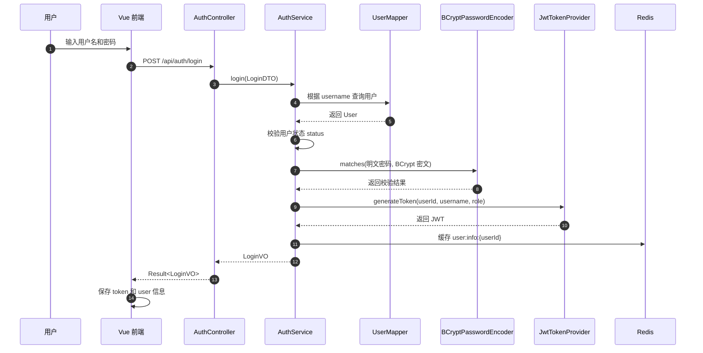
```mermaid
sequenceDiagram
    autonumber
    participant U as 用户
    participant FE as Vue 前端
    participant AC as AuthController
    participant AS as AuthService
    participant UM as UserMapper
    participant PE as BCryptPasswordEncoder
    participant JWT as JwtTokenProvider
    participant R as Redis

    U->>FE: 输入用户名和密码
    FE->>AC: POST /api/auth/login
    AC->>AS: login(LoginDTO)
    AS->>UM: 根据 username 查询用户
    UM-->>AS: 返回 User
    AS->>AS: 校验用户状态 status
    AS->>PE: matches(明文密码, BCrypt 密文)
    PE-->>AS: 返回校验结果
    AS->>JWT: generateToken(userId, username, role)
    JWT-->>AS: 返回 JWT
    AS->>R: 缓存 user:info:{userId}
    AS-->>AC: LoginVO
    AC-->>FE: Result<LoginVO>
    FE->>FE: 保存 token 和 user 信息
```

#### 5.1.3 JWT 请求认证流程

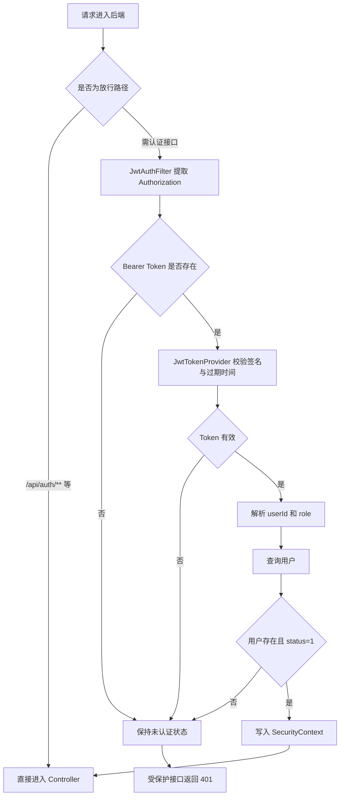
```mermaid
flowchart TD
    A[请求进入后端] --> B{是否为放行路径}
    B -->|/api/auth/** 等| C[直接进入 Controller]
    B -->|需认证接口| D[JwtAuthFilter 提取 Authorization]
    D --> E{Bearer Token 是否存在}
    E -->|否| F[保持未认证状态]
    E -->|是| G[JwtTokenProvider 校验签名与过期时间]
    G --> H{Token 有效}
    H -->|否| F
    H -->|是| I[解析 userId 和 role]
    I --> J[查询用户]
    J --> K{用户存在且 status=1}
    K -->|否| F
    K -->|是| L[写入 SecurityContext]
    L --> C
    F --> M[受保护接口返回 401]
```

#### 5.1.4 登出流程

用户登出时，后端解析当前 JWT 的剩余有效期，并将 Token 写入 Redis 黑名单，Key 格式为 `token:blacklist:{token}`，过期时间与 JWT 剩余有效期一致。设计意图是保留 JWT 无状态访问优势，同时支持主动登出失效。

说明：当前过滤器完成 JWT 有效性校验与用户状态校验；设计上应在认证过滤阶段同步检查 Token 黑名单，以确保登出后的 Token 无法继续访问受保护接口。

#### 5.1.5 密码安全

- 用户注册和修改密码时使用 BCrypt 哈希存储。
- 登录时使用 `PasswordEncoder.matches` 进行校验，不进行明文密码比对。
- 密码字段不应在前端用户信息展示接口中返回。当前接口返回 `User` 实体时，应通过 VO 或序列化忽略策略屏蔽敏感字段。

### 5.2 项目与代码资产模块

#### 5.2.1 项目创建流程

项目创建时，系统根据 `teamId` 校验当前用户是否属于该团队。校验通过后写入项目基础信息，包括项目名称、描述、源码类型、Git URL、Git 分支、语言和创建者。

项目初始状态为 `PENDING`，表示源码尚未审查或等待审查。

#### 5.2.2 代码上传流程

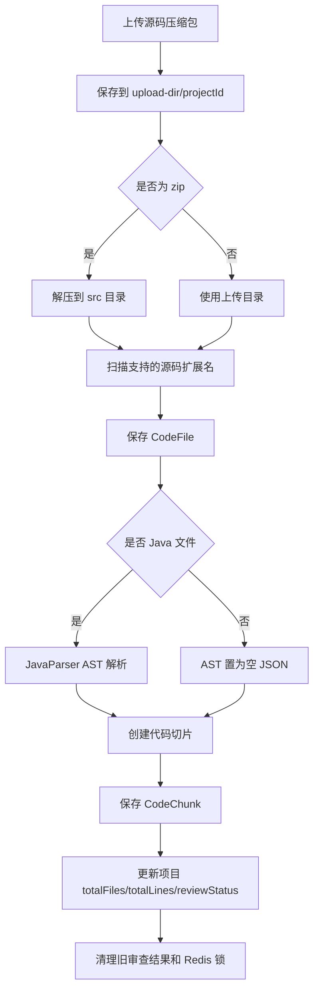
```mermaid
flowchart TD
    A[上传源码压缩包] --> B[保存到 upload-dir/projectId]
    B --> C{是否为 zip}
    C -->|是| D[解压到 src 目录]
    C -->|否| E[使用上传目录]
    D --> F[扫描支持的源码扩展名]
    E --> F
    F --> G[保存 CodeFile]
    G --> H{是否 Java 文件}
    H -->|是| I[JavaParser AST 解析]
    H -->|否| J[AST 置为空 JSON]
    I --> K[创建代码切片]
    J --> K
    K --> L[保存 CodeChunk]
    L --> M[更新项目 totalFiles/totalLines/reviewStatus]
    M --> N[清理旧审查结果和 Redis 锁]
```

#### 5.2.3 Git 拉取流程

Git 拉取由 `ProjectService.pullFromGit` 编排，`GitService` 基于 JGit 执行仓库克隆。克隆完成后复用代码扫描、AST 解析、切片保存与项目状态更新流程。

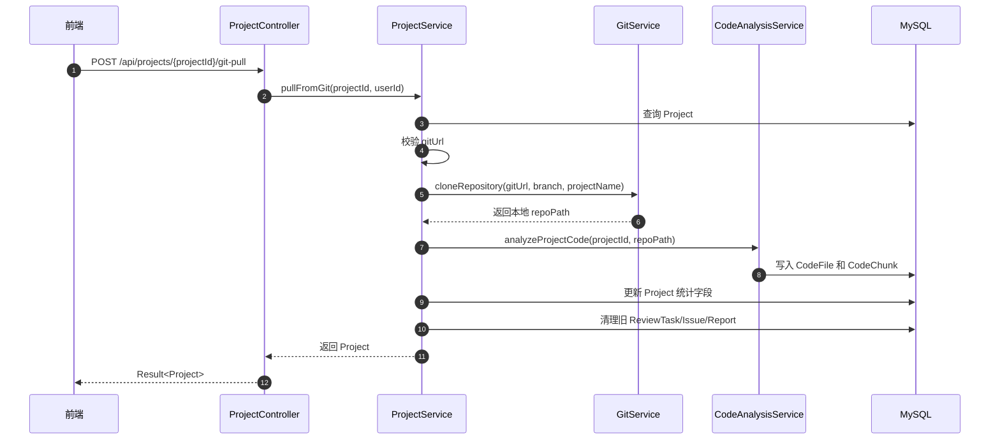
```mermaid
sequenceDiagram
    autonumber
    participant FE as 前端
    participant PC as ProjectController
    participant PS as ProjectService
    participant GS as GitService
    participant CAS as CodeAnalysisService
    participant DB as MySQL

    FE->>PC: POST /api/projects/{projectId}/git-pull
    PC->>PS: pullFromGit(projectId, userId)
    PS->>DB: 查询 Project
    PS->>PS: 校验 gitUrl
    PS->>GS: cloneRepository(gitUrl, branch, projectName)
    GS-->>PS: 返回本地 repoPath
    PS->>CAS: analyzeProjectCode(projectId, repoPath)
    CAS->>DB: 写入 CodeFile 和 CodeChunk
    PS->>DB: 更新 Project 统计字段
    PS->>DB: 清理旧 ReviewTask/Issue/Report
    PS-->>PC: 返回 Project
    PC-->>FE: Result<Project>
```

### 5.3 代码审查模块

#### 5.3.1 模块职责

代码审查模块是系统核心模块，负责将项目下的 CodeChunk 转换为审查任务，通过异步机制调用 AI 服务，并将 AI 返回的问题保存为结构化 ReviewIssue，最终生成 ReviewReport。

主要参与类：

| 类 | 职责 |
| --- | --- |
| `ReviewController` | 提供启动审查、进度查询、问题查询、报告查询接口 |
| `ReviewService` | 创建任务、处理切片审查、保存问题、生成报告 |
| `ReviewTaskProducer` | 将任务投递到 RabbitMQ |
| `ReviewTaskConsumer` | 消费审查队列并调用审查逻辑 |
| `ReviewTaskExecutor` | RabbitMQ 关闭时的线程池降级执行器 |
| `AIService` | 封装 AI 提供商调用与响应解析 |
| `ApiKeyService` | 获取用户激活的 AI 密钥并完成解密 |

#### 5.3.2 审查任务状态

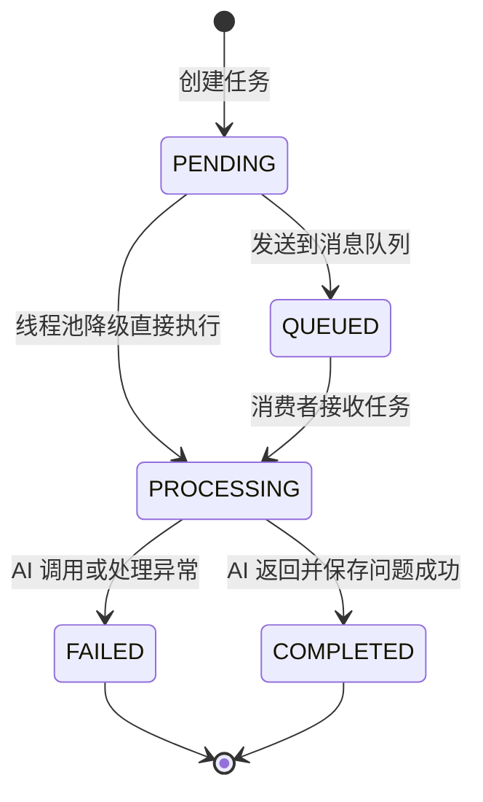
```mermaid
stateDiagram-v2
    [*] --> PENDING: 创建任务
    PENDING --> QUEUED: 发送到消息队列
    PENDING --> PROCESSING: 线程池降级直接执行
    QUEUED --> PROCESSING: 消费者接收任务
    PROCESSING --> COMPLETED: AI 返回并保存问题成功
    PROCESSING --> FAILED: AI 调用或处理异常
    FAILED --> [*]
    COMPLETED --> [*]
```

说明：数据库状态枚举中包含 `QUEUED`，当前生产者投递时主要依赖 RabbitMQ 日志记录，任务创建后状态初始为 `PENDING`，消费者处理时更新为 `PROCESSING`。

#### 5.3.3 启动审查活动图

```mermaid
flowchart TD
    A[用户点击开始审查] --> B[POST /api/review/projects/{projectId}/start]
    B --> C[Redis setIfAbsent 获取项目审查锁]
    C --> D{是否获取成功}
    D -->|否| E[返回项目正在审查中]
    D -->|是| F[查询 Project]
    F --> G{项目是否存在}
    G -->|否| H[抛出项目不存在]
    G -->|是| I[更新 Project.reviewStatus=IN_PROGRESS]
    I --> J[查询项目所有 CodeChunk]
    J --> K{切片是否为空}
    K -->|是| L[抛出请先上传代码]
    K -->|否| M[清空旧任务/问题/报告]
    M --> N[遍历切片创建 ReviewTask]
    N --> O{RabbitMQ 是否启用}
    O -->|是| P[发送任务到 code.review.queue]
    O -->|否| Q[提交到 @Async 线程池]
    P --> R[立即返回审查已启动]
    Q --> R
```

#### 5.3.4 RabbitMQ 异步审查顺序图

```mermaid
sequenceDiagram
    autonumber
    participant FE as Vue 前端
    participant RC as ReviewController
    participant RS as ReviewService
    participant Redis as Redis
    participant DB as MySQL
    participant Producer as ReviewTaskProducer
    participant MQ as RabbitMQ
    participant Consumer as ReviewTaskConsumer
    participant AK as ApiKeyService
    participant AI as AIService

    FE->>RC: POST /api/review/projects/{projectId}/start
    RC->>RS: startReview(projectId, userId)
    RS->>Redis: 获取 review:lock:project:{projectId}
    RS->>DB: 更新 Project 为 IN_PROGRESS
    RS->>DB: 查询 CodeChunk 列表
    RS->>DB: 清理旧 ReviewTask/ReviewIssue/ReviewReport
    loop 每个 CodeChunk
        RS->>DB: 插入 ReviewTask(PENDING)
        RS->>Producer: sendReviewTask(task)
        Producer->>MQ: 发布到 code.review.exchange
    end
    RC-->>FE: 返回任务已启动

    MQ-->>Consumer: 投递 ReviewTask
    Consumer->>RS: processChunkReview(task)
    RS->>DB: 更新任务为 PROCESSING
    RS->>DB: 查询 CodeChunk 和 CodeFile
    RS->>AK: 获取用户激活 API Key
    AK-->>RS: 返回解密后的 UserApiKey 或 null
    RS->>AI: reviewCodeChunk(chunkContent, metadata, userKey)
    AI-->>RS: 返回 JSON 审查结果
    RS->>DB: 保存 ReviewIssue
    RS->>DB: 更新任务为 COMPLETED
    Consumer->>MQ: basicAck
    Consumer->>RS: afterTaskComplete(projectId)
    RS->>DB: 统计任务完成情况
    alt 全部任务完成且存在成功任务
        RS->>DB: 聚合 ReviewReport
        RS->>DB: 更新 Project 为 COMPLETED
        RS->>Redis: 释放审查锁和进度缓存
    else 全部任务失败
        RS->>DB: 更新 Project 为 FAILED
        RS->>Redis: 释放审查锁和进度缓存
    end
```

#### 5.3.5 AI 分析结果处理

AI 服务要求模型返回固定 JSON 格式：

```json
{
  "issues": [
    {
      "lineStart": 1,
      "lineEnd": 1,
      "severity": "CRITICAL",
      "category": "SECURITY",
      "title": "问题标题",
      "description": "问题描述",
      "suggestion": "修复建议",
      "fixedCode": "修复后的代码片段"
    }
  ],
  "summary": "整体代码质量评估"
}
```

系统将切片内相对行号转换为文件绝对行号，转换规则为：

```text
absoluteLineStart = chunk.startLine + issue.lineStart - 1
absoluteLineEnd   = chunk.startLine + issue.lineEnd - 1
```

随后保存 `ReviewIssue`，默认问题状态为 `OPEN`。当所有任务结束后，系统按严重程度和分类聚合生成 `ReviewReport`。

### 5.4 API 密钥管理模块

API 密钥管理模块允许用户配置不同 AI 服务提供商的密钥，当前支持 `tongyi`、`wenxin`、`openai`、`custom`。保存时使用 `AESUtils` 对 API Key 和 Secret Key 加密，查询时返回脱敏后的 VO。

```mermaid
flowchart TD
    A[用户保存 API Key] --> B[ApiKeyController]
    B --> C[解析 JWT 获取 userId]
    C --> D[ApiKeyService.saveApiKey]
    D --> E[按 userId + provider 查找已有配置]
    E --> F[AES 加密 apiKey/secretKey]
    F --> G[保存或更新 user_api_key]
    G --> H{是否设置为激活}
    H -->|是| I[取消其他激活配置并激活当前配置]
    H -->|否| J[保持当前激活状态]
    I --> K[验证 API Key]
    J --> K
    K --> L[更新 is_valid 和 last_validated_at]
    L --> M[返回脱敏 ApiKeyVO]
```

### 5.5 统计分析模块

统计分析模块为前端 ECharts 图表提供数据，主要包括：

- 项目总数。
- 已完成审查项目数。
- 总问题数。
- 待解决问题数。
- 严重程度分布。
- 问题分类分布。
- Bug 率趋势。

前端图表组件包括 `SeverityPie`、`CategoryBar`、`TrendLine` 等。

## 6. 接口设计

### 6.1 RESTful API 通用规范

#### 6.1.1 请求规范

- 基础路径：`/api`
- 数据格式：JSON，文件上传接口使用 `multipart/form-data`
- 认证方式：受保护接口需携带请求头 `Authorization: Bearer {token}`
- 时间格式：建议使用 ISO-8601 或后端默认 `LocalDateTime` 序列化格式

#### 6.1.2 响应规范

系统统一使用 `Result<T>` 包装响应。典型结构如下：

```json
{
  "code": 200,
  "message": "success",
  "data": {}
}
```

错误响应示例：

```json
{
  "code": 500,
  "message": "项目不存在",
  "data": null
}
```

### 6.2 认证接口

| 方法 | 路径 | 认证 | 说明 |
| --- | --- | --- | --- |
| POST | `/api/auth/login` | 否 | 用户登录，返回 JWT 和用户信息 |
| POST | `/api/auth/logout` | 是 | 登出，将 Token 写入 Redis 黑名单 |
| POST | `/api/auth/register` | 否 | 用户注册 |
| GET | `/api/auth/me` | 是 | 获取当前登录用户 |
| PUT | `/api/auth/profile` | 是 | 更新用户资料 |
| PUT | `/api/auth/password` | 是 | 修改密码 |
| POST | `/api/auth/avatar` | 是 | 上传头像 |

### 6.3 团队接口

| 方法 | 路径 | 认证 | 说明 |
| --- | --- | --- | --- |
| POST | `/api/teams` | 是 | 创建团队，并将创建者设为 `LEADER` |
| GET | `/api/teams/my` | 是 | 获取当前用户加入的团队 |
| GET | `/api/teams/{teamId}/members` | 是 | 获取团队成员列表 |
| POST | `/api/teams/{teamId}/members` | 是 | 添加团队成员，需 `LEADER` 或 `ADMIN` |
| DELETE | `/api/teams/{teamId}/members/{userId}` | 是 | 移除团队成员，需 `LEADER` 或 `ADMIN` |
| DELETE | `/api/teams/{teamId}` | 是 | 删除团队，限团队创建者 |

### 6.4 项目接口

| 方法 | 路径 | 认证 | 说明 |
| --- | --- | --- | --- |
| POST | `/api/projects` | 是 | 创建项目 |
| GET | `/api/projects` | 是 | 分页查询当前用户项目 |
| GET | `/api/projects/{projectId}` | 是 | 获取项目详情 |
| POST | `/api/projects/{projectId}/upload` | 是 | 上传项目源码包 |
| POST | `/api/projects/{projectId}/git-pull` | 是 | 从 Git 仓库拉取源码 |
| DELETE | `/api/projects/{projectId}` | 是 | 删除项目，限创建者 |
| DELETE | `/api/projects/{projectId}/files/{fileId}` | 是 | 删除项目中的单个代码文件 |

### 6.5 代码文件接口

| 方法 | 路径 | 认证 | 说明 |
| --- | --- | --- | --- |
| GET | `/api/code/projects/{projectId}/files` | 是 | 查询项目代码文件列表，不返回文件内容 |
| GET | `/api/code/files/{fileId}` | 是 | 查询单个文件内容 |
| GET | `/api/code/projects/{projectId}/chunks` | 是 | 查询项目代码切片 |
| GET | `/api/code/history` | 是 | 查询审查历史，可按用户和状态筛选 |
| DELETE | `/api/code/history/{projectId}` | 是 | 删除历史记录及关联数据 |
| GET | `/api/files/avatars/{filename}` | 否 | 获取头像静态资源 |

### 6.6 审查接口

| 方法 | 路径 | 认证 | 说明 |
| --- | --- | --- | --- |
| POST | `/api/review/projects/{projectId}/start` | 是 | 启动项目代码审查 |
| GET | `/api/review/projects/{projectId}/progress` | 是 | 查询审查进度 |
| GET | `/api/review/projects/{projectId}/issues` | 是 | 查询项目全部问题 |
| GET | `/api/review/projects/{projectId}/files/{filePath}/issues` | 是 | 查询指定文件的问题 |
| GET | `/api/review/projects/{projectId}/stats` | 是 | 查询项目问题统计 |
| GET | `/api/review/projects/{projectId}/report` | 是 | 查询审查报告 |

### 6.7 API 密钥接口

| 方法 | 路径 | 认证 | 说明 |
| --- | --- | --- | --- |
| GET | `/api/api-keys` | 是 | 查询当前用户 API Key 配置列表 |
| POST | `/api/api-keys` | 是 | 保存或更新 API Key |
| PUT | `/api/api-keys/{id}/activate` | 是 | 激活指定 API Key |
| POST | `/api/api-keys/{id}/validate` | 是 | 验证 API Key 可用性 |
| DELETE | `/api/api-keys/{id}` | 是 | 删除 API Key |
| GET | `/api/api-keys/models/{provider}` | 是 | 获取指定提供商的可选模型 |

### 6.8 统计接口

| 方法 | 路径 | 认证 | 说明 |
| --- | --- | --- | --- |
| GET | `/api/stats/dashboard` | 是 | 获取仪表盘统计数据 |
| GET | `/api/stats/bug-rate-trend` | 是 | 获取 Bug 率趋势数据 |

## 7. 安全设计

### 7.1 JWT 认证

系统使用 JWT 作为无状态访问凭证。Token 中包含：

- `sub`：用户名。
- `userId`：用户 ID。
- `role`：用户系统角色。
- `iat`：签发时间。
- `exp`：过期时间。

后端通过 `JwtAuthFilter` 从 `Authorization` 请求头提取 Token，经 `JwtTokenProvider` 验证签名和有效期后，将用户实体和角色权限写入 `SecurityContext`。

### 7.2 权限控制

系统权限分为系统角色和团队角色两类：

| 类型 | 角色 | 说明 |
| --- | --- | --- |
| 系统角色 | `ADMIN` | 系统管理员 |
| 系统角色 | `TEAM_LEADER` | 团队负责人 |
| 系统角色 | `DEVELOPER` | 默认开发者角色 |
| 系统角色 | `VIEWER` | 只读用户 |
| 团队角色 | `LEADER` | 团队创建者或负责人 |
| 团队角色 | `ADMIN` | 团队管理员 |
| 团队角色 | `MEMBER` | 普通团队成员 |

当前业务权限主要在 Service 层实现：

- 创建项目时，若指定团队，则要求当前用户属于该团队。
- 添加或移除团队成员时，要求操作者为团队 `LEADER` 或 `ADMIN`。
- 删除团队时，要求操作者为团队创建者。
- 删除项目时，要求操作者为项目创建者。

### 7.3 密码安全

- 密码使用 BCrypt 单向哈希存储。
- 登录错误统一返回“用户名或密码错误”，避免泄露用户是否存在。
- 修改密码必须校验旧密码。
- 设计上应避免在用户信息接口中返回 `password` 字段。

### 7.4 API Key 安全

- 用户 API Key 和 Secret Key 使用 AES 加密后存储在 `user_api_key` 表。
- 查询接口返回 `ApiKeyVO`，应进行密钥脱敏，不返回明文密钥。
- AI 审查时优先使用用户当前激活且可解密的密钥；未配置时使用系统默认 AI 配置。
- `AES_SECRET` 应通过环境变量注入，避免在生产配置中使用默认值。

### 7.5 Redis 安全用途

Redis 在系统中承担以下安全和并发控制职责：

- `token:blacklist:{token}`：登出 Token 黑名单。
- `user:info:{userId}`：用户信息缓存。
- `review:lock:project:{projectId}`：防止同一项目重复启动审查。
- `review:genlock:{projectId}`：防止并发重复生成报告。

### 7.6 接口与文件安全

- 文件上传限制由 Spring Multipart 配置控制，当前最大文件大小为 100MB，请求最大大小为 200MB。
- 代码扫描仅处理配置中的扩展名：`java`、`py`、`js`、`ts`、`go`。
- Git 克隆目录和上传目录应隔离在服务工作目录之外，避免覆盖应用文件。
- 生产环境应关闭调试日志中的敏感信息输出，尤其是 AI 调用错误体和密钥相关字段。

## 8. 部署设计

### 8.1 Docker 单机部署架构

系统采用 Docker Compose 单机编排，包含前端、后端、MySQL、Redis、RabbitMQ 五类服务。

```mermaid
flowchart TB
    User[用户浏览器] -->|HTTP 80| Nginx[frontend 容器 / Nginx]
    Nginx -->|反向代理 /api| Backend[backend 容器 / Spring Boot 8088]
    Backend -->|JDBC 3306| MySQL[(mysql 容器)]
    Backend -->|Redis 6379| Redis[(redis 容器)]
    Backend -->|AMQP 5672| RabbitMQ[(rabbitmq 容器)]
    Backend -->|HTTPS| AI[外部 AI 服务]
    Backend -->|HTTPS/SSH| GitRepo[Git 仓库]
    RabbitMQ -->|管理台 15672| Admin[运维管理]
```

### 8.2 docker-compose 服务组成

| 服务 | 镜像或构建 | 端口 | 职责 |
| --- | --- | --- | --- |
| mysql | `mysql:8.0` | `3306:3306` | 存储业务数据，初始化 `code_inspector` 数据库 |
| redis | `redis:7-alpine` | `6379:6379` | 缓存、Token 黑名单、审查锁 |
| rabbitmq | `rabbitmq:3.12-management-alpine` | `5672:5672`、`15672:15672` | 审查任务队列与管理控制台 |
| backend | `./backend/Dockerfile` | `8088:8088` | Spring Boot 后端服务 |
| frontend | `./frontend/Dockerfile` | `80:80` | Nginx 托管前端静态资源并转发 API |

### 8.3 后端容器设计

后端 Dockerfile 使用多阶段构建：

1. 构建阶段使用 `eclipse-temurin:17-jdk-alpine`，安装 Maven 并执行 `mvn clean package -DskipTests`。
2. 运行阶段使用 `eclipse-temurin:17-jre-alpine`，复制构建产物为 `app.jar`。
3. 暴露端口 `8088`，通过 `java -jar app.jar` 启动。

### 8.4 前端容器设计

前端 Dockerfile 使用多阶段构建：

1. 构建阶段使用 `node:20-alpine`，执行 `npm install` 和 `npm run build`。
2. 运行阶段使用 `nginx:alpine`，将 `dist` 复制到 Nginx 静态目录。
3. 复制自定义 `nginx.conf`，暴露端口 `80`。

### 8.5 环境变量与配置

后端容器通过 Compose 注入以下关键配置：

| 变量 | 说明 |
| --- | --- |
| `SPRING_DATASOURCE_URL` | MySQL JDBC 连接地址 |
| `SPRING_DATASOURCE_USERNAME` | MySQL 用户名 |
| `SPRING_DATASOURCE_PASSWORD` | MySQL 密码 |
| `SPRING_DATA_REDIS_HOST` | Redis 主机名 |
| `SPRING_RABBITMQ_HOST` | RabbitMQ 主机名 |
| `AES_SECRET` | AES 加密密钥，建议生产环境显式设置 |
| `WENXIN_API_KEY`、`WENXIN_SECRET_KEY` | 文心一言默认密钥 |

### 8.6 RabbitMQ 队列设计

| 名称 | 类型 | 说明 |
| --- | --- | --- |
| `code.review.exchange` | DirectExchange | 审查任务交换机 |
| `code.review.queue` | Queue | 审查任务主队列 |
| `code.review.routing` | Routing Key | 主队列路由键 |
| `code.review.dlx.exchange` | DirectExchange | 死信交换机 |
| `code.review.dlx.queue` | Queue | 死信队列 |
| `code.review.dlx.routing` | Routing Key | 死信路由键 |

主队列配置：

- 队列持久化。
- TTL 为 600000 毫秒。
- 最大长度为 1000。
- 消费并发数为 2。
- 使用手动 ACK。

### 8.7 部署启动顺序

```mermaid
flowchart LR
    A[启动 MySQL] --> B[执行 schema.sql]
    B --> C[MySQL 健康检查通过]
    D[启动 Redis] --> E[Redis 健康检查通过]
    F[启动 RabbitMQ] --> G[RabbitMQ 健康检查通过]
    C --> H[启动 Backend]
    E --> H
    G --> H
    H --> I[启动 Frontend]
    I --> J[用户访问 80 端口]
```

## 9. 非功能性设计

### 9.1 性能设计

- 使用代码切片控制单次 AI 请求输入长度。
- 使用 RabbitMQ 异步处理审查任务，避免前端请求等待 AI 完成。
- 使用 ReviewReport 保存聚合结果，降低统计页重复计算成本。
- 文件列表接口默认不返回 `fileContent`，减少传输体积。

### 9.2 可用性设计

- RabbitMQ 未启用时，系统可降级为 `@Async` 线程池模式执行审查任务。
- 审查进度接口可在任务全部完成但项目状态仍为 `IN_PROGRESS` 时触发自动修复，尝试生成报告并更新项目状态。
- 审查任务失败不会阻断其他切片任务，报告生成时允许部分失败。

### 9.3 可维护性设计

- 业务逻辑集中在 Service 层，Controller 保持薄接口层。
- 数据模型按业务域拆分为用户、团队、项目、代码、审查、报告和密钥。
- AI 提供商调用集中在 `AIService`，便于扩展新的模型供应商。
- 代码分析逻辑集中在 `CodeAnalysisService`，便于扩展更多语言解析器。

### 9.4 可观测性设计

- 关键审查流程使用日志记录，包括任务创建、入队、消费、完成、失败和报告生成。
- RabbitMQ 管理台可查看队列堆积与消费情况。
- 数据库中保留 ReviewTask 状态与错误信息，用于追踪审查失败原因。

## 10. 设计约束与后续优化建议

### 10.1 当前设计约束

- 数据库初始化脚本未显式声明外键，当前依赖业务代码维护级联删除和关系一致性。
- AI 响应依赖模型返回 JSON，虽然系统进行了 Markdown 代码块清理和异常兜底，但仍存在格式不稳定风险。
- Java 文件支持 AST 切片，其他语言主要使用行级切片。
- 开发环境配置中 RabbitMQ 默认关闭，生产环境需确认 `spring.rabbitmq.enabled=true`。

### 10.2 后续优化建议

| 方向 | 建议 |
| --- | --- |
| 权限控制 | 引入项目级成员权限校验，避免仅依赖创建者和团队成员判断 |
| Token 黑名单 | 在 JWT 过滤器中显式检查 Redis 黑名单 |
| 数据完整性 | 为核心关系增加外键或统一的数据清理服务 |
| AI 稳定性 | 引入 JSON Schema 校验与失败重试策略 |
| 多语言审查 | 为 Python、JavaScript、TypeScript、Go 接入对应 AST 或语法解析器 |
| 任务可靠性 | 记录重试次数，避免 RabbitMQ `basicNack` 无限重新入队 |
| 敏感配置 | 生产环境移除默认 AI Key 和默认 AES Secret，全部改为环境变量 |
| 报告能力 | 增加问题处理状态变更接口与报告导出能力 |
